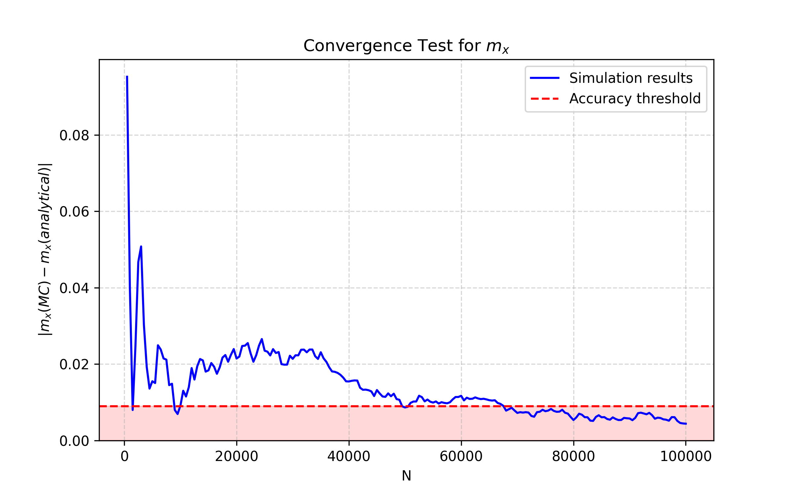
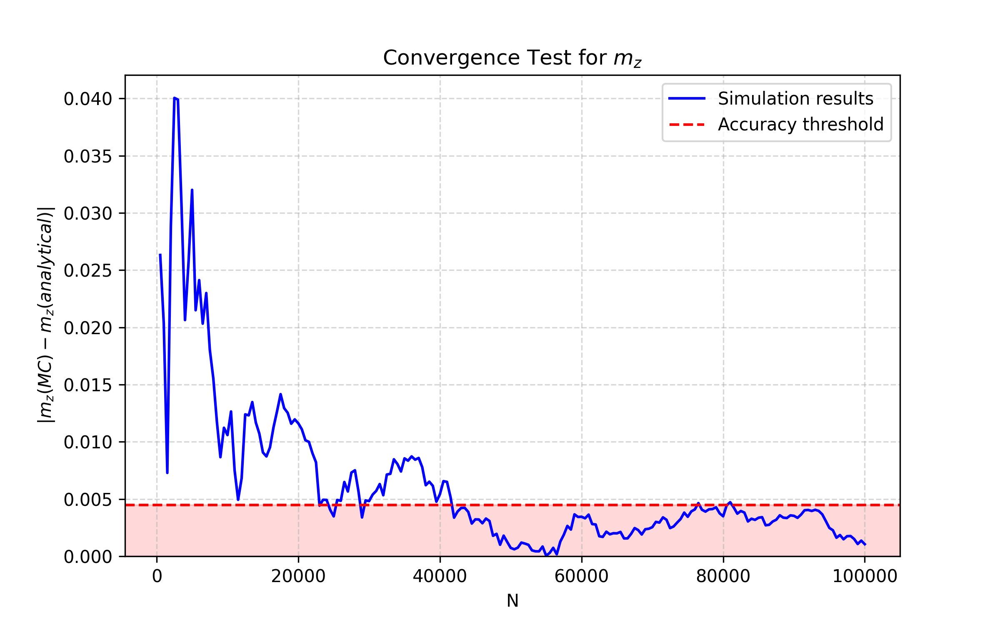
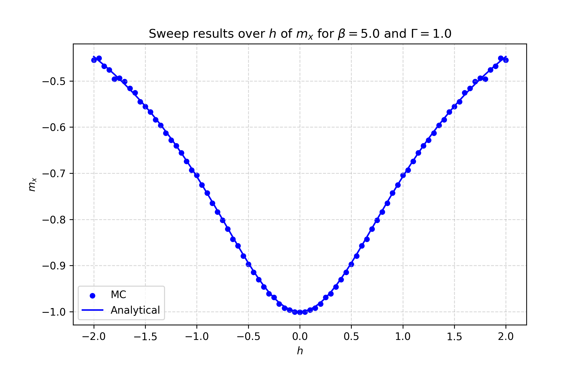
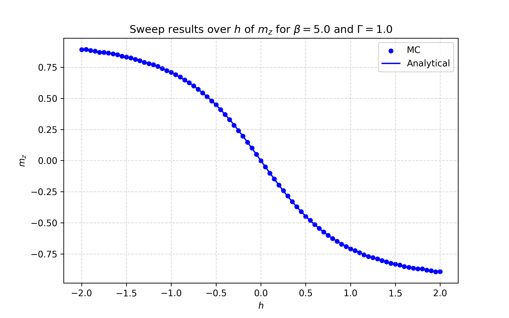
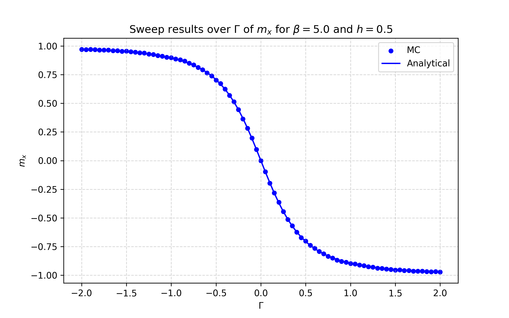
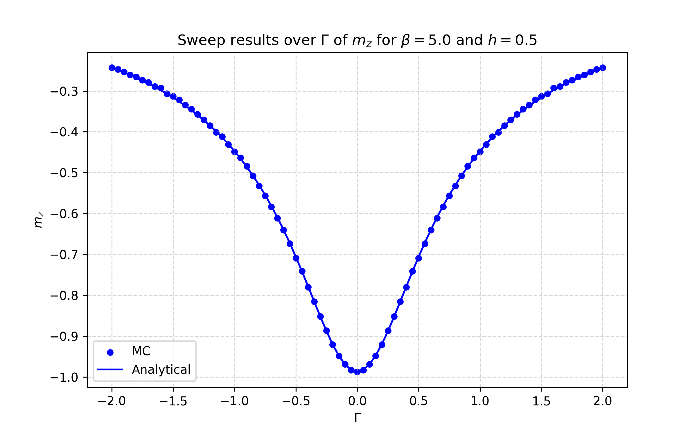
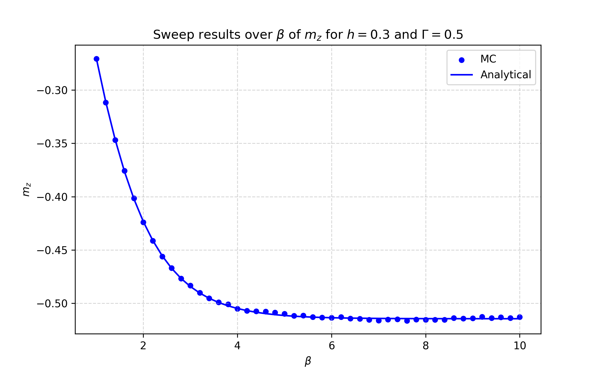

# DiagMC_2_level_spin_system
This program implements a Diagrammatic Monte Carlo (DMC) simulation of a two level spin system exploiting [Markov Chain Monte Carlo](https://pubs.aip.org/aip/jcp/article/21/6/1087/202680/Equation-of-State-Calculations-by-Fast-Computing) and the [Metropolis-Hastings algorithm](https://academic.oup.com/biomet/article/57/1/97/284580). DMC is used to sample the Feynman diagrams of different orders that appear in the partition function of the system. The simulation aims at obtaining estimators for the magnetization along the longitudinal and transverse direction and at comparing them with their exact analytical expressions. This work aims at proving the validity of the method in order to justify its usage for more complex problems, which do not have an analytical solution.

## Installation and tests

To clone the repository on your local machine type:

```bash
$ git clone https://github.com/lorenzo-riguzzi/DiagMC_2_level_spin_system.git
$ cd DiagMC_2_level_spin_system
```

All the required packages used in the software are included in the [requirements.txt](requirements.txt) file. You can install everything needed to run the simulation using [pip](https://pypi.org/project/pip/) by running:

```bash
$ pip install -e .
```

TypeErrors are checked with [mypy](https://mypy.readthedocs.io/en/stable/). To verify that no TypeError is present in the code run:

```bash
$ python -m mypy . --explicit-package-bases --ignore-missing-imports
```

The files that perform unit testing are contained in the [tests](tests) folder and are [test_diagram.py](tests/test_diagram.py) and [test_simulation.py](tests/test_simulation.py). These contain the tests relative to the function in the [diagram.py](scripts/diagram.py) file and [simulation.py](scripts/simulation.py) file respectively. Tests are performed using [pytest](https://happytest.readthedocs.io/en/latest/contents/). To ensure that all the tests are passed run:

```bash
$ python -m pytest
```


## How to run the simulation

The user can run the required calculation by running:

```bash
$ python main.py config.yaml
```

or, more simply, even by running:

```bash
$ diagmc config.yaml
```

In these last commands, instead of *config.yaml* users can specify their own configuration file in .yaml format with the desired name. This file is the configuration input file required to perform a calculation. An example [config.yaml](config.yaml) is already furnished and can be used and modified to run the simulation. If the user uses a configuration file with this name it is not necessary to specify the name when calling [main.py](main.py) or the *diagmc* command. Users can thus simply run:

```bash
$ python main.py
```

or just:

```bash
$ diagmc
```


 In the [config.yaml](config.yaml) specify the type of calculation that you want to perform: *single_run*, *convergence_test* or *sweep* in the *mode* option of the file. Further details on this are written in the [Structure of the code](#structure-of-the-code) section.

If the user performs a *convergence_test* or a *sweep* calculation the results are printed in a *.csv* file. These results can be visualized graphically using the scripts in the [plots](plots) folder. To visualize the results of the magnetizations as functions of the number of MC runs of a convergence test calculation run:

```bash
$ python plots/plot_convergence.py convergence_output_name.csv
```

where *convergence_output_name* is the name of the output that one wants to plot, that must be specified in the [config.yaml](config.yaml).
For the results of a sweep calculation, instead, run:

```bash
$ python plots/plot_sweep.py sweep_output_name.csv
```

where the name of the output is always to be specified in the [config.yaml](config.yaml).

## Example results

### single_run

A *single_run* calculation produces as output a single value of *m_x* and *m_z* and prints them on terminal. The results are shown in the form of a table containing the MC values, the analytical values and their absolute difference. Also the number of MC steps, the number of thermalization steps and the duration of the simulation are printed on screen:

```bash

Ignoring the first 5000 runs to thermalize the system...

Thermalization completed in 0.01 seconds.

Running the Monte Carlo simulation for 1000000 runs...

Simulation completed in 3.01 seconds.

===========================================================
        DIAGRAMMATIC MONTE CARLO: SINGLE RUN RESULTS
===========================================================
Observable |  MC Estimate  |  Analytical  |  Abs Difference
-----------------------------------------------------------
   m_z     |     -0.50994  |    -0.51148  |    0.00154
   m_x     |     -0.85358  |    -0.85247  |    0.00111
===========================================================

```

### convergence_test

The results of a convergence test are printed in *.csv* format. An example of such results is shown in the [examples](examples) folder, with the file: [convergence_test_results.csv](examples/convergence_test_results.csv). The calculation also prints on terminal after which number of MC runs the required accuracy is reached for the two magnetizations. All these results can be visualized in an easier way by plotting the results using the [plot_convergence.py](plots/plot_convergence.py) script in the plots folder. Examples of such results are contained in the [examples](examples) folder and are [convergence_test_results_m_x.png](examples/convergence_test_results_m_x.png) and [convergence_test_results_m_z.png](examples/convergence_test_results_m_z.png):

<p align="center">
  
  
</p>

here the red area contains the points that are below the required convergence threshold. Convergence is considered to be reached if all the points after a certain *N_runs* are inside the red area. Notice that if you want to visualize these results without first running the simulation by yourself you need to create a *results* folder and copy inside it the data you want to plot from the [examples](examples) folder, since the script looks for data inside the results folder. In order to do so do first:

```bash

$ mkdir results
$ cp examples/convergence_test_results.csv results

```


### sweep

The results of the sweep mode are printed in a *.csv* file. In the [examples](examples) folder one can find an example for each possible variable of the magnetizations ($h$, $\Gamma$, $\beta$). These are the files [sweep_h.csv](examples/sweep_h.csv), [sweep_Gamma.csv](examples/sweep_Gamma.csv) and [sweep_beta.csv](examples/sweep_beta.csv). These contain the MC and analytical results of the two magnetizations, together also with the variables kept fixed during the simulation (which are used by the plotting script to insert them in the titles of the plots). These results were obtained with *N_runs = 500000* for the sweeps over $h$ and $\Gamma$ and for *N_runs = 1000000* for the sweep over $\beta$, which required a higher number of MC runs to reach a good agreement with the analytical values for high $\beta$. The [examples](examples) folder also contains the plots [sweep_h_m_x.png](examples/sweep_h_m_x.png), [sweep_h_m_z.png](examples/sweep_h_m_z.png), [sweep_Gamma_m_x.png](examples/sweep_Gamma_m_x.png), [sweep_Gamma_m_z.png](examples/sweep_Gamma_m_z.png), [sweep_beta_m_x.png](examples/sweep_beta_m_x.png) and [sweep_beta_m_z.png](examples/sweep_beta_m_z.png):

<p align="center">
  
  
</p>

<p align="center">
  
  
</p>

<p align="center">
  
  
</p>

Similarly to what was said before, if you want to plot the results without running the simulation on your own do first:

```bash

$ mkdir results
$ cp examples/sweep_h.csv results
$ cp examples/sweep_Gamma.csv results
$ cp examples/sweep_beta.csv results

```


## Structure of the code

### [config.yaml](config.yaml)

This is the input file of the code and is the only one that needs to be modified by the user. It is divided in three sections:

- *diagram_params*, in which the user can specify the quantities that characterize the starting Feynman diagram (including the random seed used in the simulation);
- *simulation_params*, where the user can specify the number *N_runs* of Monte Carlo runs to perform while collecting data and the number *N_thermalization* of thermalization runs to perform before actually starting collecting data. These are performed since the first results obtained might be biased by the chosen initial configuration of the diagram and thus influence negatively the statistics;
- *mode*, which allows the user to choose between three possible simulations to perform: *single_run*, *convergence_test* and *sweep*. 

For the first mode a single Monte Carlo simulation is performed using the diagram specified in *diagram_params*. The second one performs a convergence test by running several Monte Carlo simulations at different values of *N_runs*. To perform this kind of calculation the user needs to additionally specify the beginning and the ending values *N_start* and *N_end* of *N_runs* and the step *N_step* that separate each used value of *N_runs*. Eventually the user needs to specify the accuracy threshold that he wants to achieve with the convergence test, expressed as percentage and the name of the output file. The accuracy threshold is the the percentage error accepted for the MC magnetization with respect to the analytical value. The last mode instead allows to chose a variable among those that define a diagram ($h$, $\Gamma$ and $\beta$) and perform a sweep for several values of that variable. Here the user needs to specify the variable over which the sweep will be performed, its starting value *variable_start* and its ending value *variable_end* together with the step *variable_step* that separates two consecutive values of the variable (pay ATTENTION on the fact that the $\beta$ variable, even during the sweep, can only be positive, while $h$ and $\Gamma$ do not have limitations on their possible values, so if $\beta$ is chosen to be the variable the sweeping range must be chosen in such a way that it does not include negative values).

The user can also define his own alternative [config.yaml](config.yaml) file to use in the simulation, following the same structure of the furnished one. For calling a user defined configuration file named, for example, *alternative_config.yaml*, the user just need to specify it as an argument when calling the main function.


### [main.py](main.py)

This contains the main function of the code, which performs the required simulation following the instructions of the configuration file. It calls either the *single_run* function, the *convergence_test* function or the *sweep* function. If no argument is specified when calling [main.py](main.py), the function uses a file named [config.yaml](config.yaml), as the one already furnished.

### [scripts/diagram.py](scripts/diagram.py)

This file includes the **Diagram** class and the **Diagram_Random** class. The first one implements all the deterministic methods of the code. These include:

- The methods *analytical_m_x* and *analytical_m_z*, which calculate the values of the two magnetizations with the analytical formula (to compare with the values obtained with the Monte Carlo estimators);
- The methods *evaluate_m_x* and *evaluate_m_z*, which calculates the magnetizations of a single diagram;
- The methods *acceptance_rate_flip*, *acceptance_rate_add_segment* and *acceptance_rate_remove_segment*, which calculate the acceptance ratii $\alpha_{flip}$, $\alpha_{add}$ and $\alpha_{rem}$ of the updates;
- The methods *try_flip_spin*, *try_add_segment* and *try_remove_segment*, which compare the acceptance ratii with a random number (that is here given as input parameter to the method) and apply the corresponding update if the random number is lower than the acceptance ratio.

The second class, inherits all the methods of the first one and introduces randomness by including the [Mersenne Twister](https://docs.python.org/3/library/random.html) random number generator, allowing its functions *random_try_flip_spin*, *random_try_add_segment* and *random_try_remove_segment* to randomly perform the three updates by using the previously described functions of the parent class and the *choose_update* method that randomly chooses one of the three updates with equal probability 1/3.


### [scripts/simulation.py](scripts/simulation.py)

This file implements the three different simulation modes. All these functions take a *config* dictionary as input, which will be the one obtained from the configuration file. The three functions are the following ones:

- *single_run*: This function creates a Diagram_Random object following the instructions of the configuration file and uses it to evaluate the analytical values of the magnetizations and those obtained with the MC estimators. Once it finishes it prints on terminal the time taken to perform the simulation and both the MC and the analytical values of the two magnetizations. It also prints the modulus of the difference between the MC estimated value and the analytical one.
- *convergence_test*: This function allows to perform a convergence test simulation by performing an MC cycle and evaluating *m_x* and *m_z* for different values of *N_runs*. The aim of this function is finding the minimum value of $N$ among the proposed ones such that the required accuracy is reached. This value can then be used as an optimized value to use in subsequent simulations in order to maximize the efficiency and still obtain reliable results. At the end of the simulation the function creates a *.csv* file (whose name can always be specified in the configuration file) which contains as columns: the number of MC runs performed, the MC values of *m_z*, their absolute difference *error_m_z* with respect to the analytical one and the accuracy threshold *threshold_m_z*, which is a constant value obtained by multiplying the analytical value of *m_z* by the required accuracy in the configuration files. The rest of the columns contain the same quantities for *m_x*. After this, the function analyses the obtained results and prints on screen the values of N after which the values of the errors of *m_z* and *m_x* are always below the required accuracy threshold.
- *sweep*: This function performs the simulation for several different diagrams (one for each required value of the sweeping variable in the configuration file). During its loop it evaluates, for each of these diagrams, the MC estimated and the analytical magnetizations and prints them in a *.csv* file whose name is always specified in the configuration file. The output also contains the values of the two other quantities over which the sweep is not done, since they will be later used when plotting the results.

## Theoretical background

[Diagrammatic Monte Carlo](https://arxiv.org/abs/0707.4259) is a powerful method which allows one to evaluate integrals which appear in the form of the diagrammatic series:

$$ Q(\{y\})=\sum_{n=0}^{\infty}\sum_{\xi_n}\int dx_1...\int dx_n D_n^{\xi_n}(\{y\}; x_1, ..., x_n) $$

We are interested in obtaining the function $Q$ which is a function of a set of external variables $\{y\}$ (usually this is a Green's function). $D_{n}^{\xi}(\{y\}; x_1, ..., x_n)$ represents the Feynmann diagrams of different order $n$ and of different topology $\xi_n$ and $x_i$ are the integration variables (in our case they will be imaginary time points).
In this simulation the method is used to study the simple problem of a two level spin system.

### Analytical solution

The starting point of the simulation is the Hamiltonian of a single spin in an external magnetic field with an $x$ and a $z$ component:

$$ \hat{H}=\hat{H}_0+\hat{H}_1=h\sigma_z+\Gamma\sigma_x $$

where $\sigma_x$, $\sigma_z$ are Pauli matrices and $h$ and $\Gamma$ are the intensities of the field along the $z$ and $x$ direction respectively. The Hamiltonian can be written in the basis of eigenstates of $\sigma_z$: $\ket{\uparrow}$ and $\ket{\downarrow}$ and can be diagonalized, finding its two eigenvalues: $E_{\pm}=\pm\sqrt{h^2+\Gamma^2}=\pm E$ and their corresponding eigenstates $\ket{\Psi_+}$ and $\ket{\Psi_-}$.

With these the partition function is given by:

$$ Z=\text{Tr}[e^{-\beta \hat{H}}]=\bra{\Psi_+}e^{-\beta \hat{H}}\ket{\Psi_+}+\bra{\Psi_-}e^{-\beta \hat{H}}\ket{\Psi_-}=2\cosh{\beta E}  $$

where $\beta=1/T$ is the inverse temperature. With this result it is possible to evaluate the analytical values of the two magnetizations:

$$ m_z = \braket{\sigma_z} = -\frac{h}{E}\tanh{\beta E} $$

$$ m_x = \braket{\sigma_x} = -\frac{\Gamma}{E}\tanh{\beta E} $$

### DMC Approach

Diagrammatic Monte Carlo approaches the problem starting from the Path Integral formulation of the partition function in imaginary time:

$$  Z=\sum_{s=\uparrow,\downarrow}\sum_{n=0}^\infty (-1)^n\int_{0}^{\beta}d\tau_1 ... \int_{\tau_{n-1}}^{\beta} \bra{s}e^{-\beta\hat{H}_0}\hat{H}_1(\tau_n)...\hat{H_1}(\tau_1)\ket{s} $$

where, for the order $n=0$ we have no interaction Hamiltonian inside the expectation value and $\tau=it$ is the imaginary time, which is such that: $0< \tau_1 < \tau_2 < ... < \tau_n < \beta$. The interaction Hamiltonian is in the interaction representation:

$$ \hat{H}_1(\tau_k) = e^{\hat{H}_0\tau_k}\hat{H}_1 e^{-\hat{H}_0\tau_k} $$

The arguments of the integral give the weight of a diagram of order $n$ with initial spin $s$ and vertices $\tau_1, ...\tau_n$. It can be proved that odd order diagrams have weight zero, while for even order diagrams the weight can be evaluated to be:

$$ D_n^s=\Gamma^ne^{-\beta hs} \prod_{i=1}^n e^{2hs(-1)^i\tau_i} $$

### DMC updates

The results obtained for odd and even order diagrams already tell us that the only updates we are interested in are those where the order of the diagram is kept odd, so those that start from an odd order diagram and add or remove an odd number of vertices or that keep the order of the diagram fixed (spin flip or movement of a vertex). Since in a Monte Carlo simulation we aim at performing many runs to explore ergodically the space of all possible configurations, all the possible updates can be reduced to the addition and the remotion of a pair of vertices. Always under the hypothesis of many runs and ergodicity all the possible updates which include the addition and remotion of vertices and the movement of a vertex without changing the order of the diagram can be constructed in terms of two minimal updates: the addition and the remotion of a segment (where for segment we mean a pair of vertices of extrema $\tau_k$ and $\tau_{k+1}$). The only update we need apart from these two is the spin flip update, which allows us to move from a configuration with $s=1$ ($s=\uparrow$), to a configuration with $s=-1$ ($s=\downarrow$). With our notation this last update corresponds to $s\rightarrow -s$. Notice that the presence of both the updates to add and remove a segment satisfies detailed balance, since they are one the inverse process of the other.
We want to implement a Markov-chain, where the different updates from an initial state $i$ to a final state $f$ are accepted with a probability that, from Metropolis-Hastings algorithm, is given by:

$$  \alpha = \min\left(1, \quad \frac{D_{n_f}^{s_f}(\{\tau\}_f)}{D_{n_i}^{s_i}(\{\tau\}_i)}\frac{p(i|f)}{p(f|i)}\right) $$

where $p(f|i)$ is the proposal distribution from which we chose the update to go from an initial configuration $i$ to a final configuration $f$, while $p(i|f)$ is the proposal distribution for the opposite process. With this we can evaluate the transition probabilities of our updates:

- **Spin flip**: The update simply flips the spin of all the segments of the diagram and is already the opposite of itself. No random number has to be extracted to find the final configuration since we only have two options, which means that we do not have a proposal distribution. The acceptance rate is:

$$ \alpha_{flip}=\min\left(1,\quad \frac{D_{n}^{-s}(\tau_1, ..., \tau_n)}{D_{n}^{s}(\tau_1, ..., \tau_n)}\right)=\min\left(1, \quad e^{2\beta hs}e^{-4hs\sum_{i=1}^n (-1)^i\tau_i}\right) $$

- **Add segment**: The update adds two vertices at indices $j$ and $j+1$. The first vertex to be added is extracted from a uniform distribution between 0 and $\beta$ and the second one from a uniform distribution between $\tau_j$ and $\tau_{j+2}$, which means that $p(f|i)=U(0, \beta)U(\tau_j, \tau_{j+2})=1/\beta\cdot 1/(\tau_{j+2}-\tau_j)$. For the opposite process, instead, the first vertex to be removed is extracted uniformly from the $n+2$ vertices present in the final configuration (except for the last vertex since we can not remove $\beta$ from the diagram) and when the first is chosen the second one is constrained to be the next one, so that here theproposal distributions is: $p(i|f)=1/(n+1)$. Putting everything together we get:

$$ \alpha_{add}=\min\left(1,\quad \frac{D_{n+2}^{s}(\tau_1, ...,\tau_j, \tau_{j+1}, ...,  \tau_{n})}{D_{n}^{s}(\tau_1, ..., \tau_n)}\frac{p(i|f)}{p(f|i)}\right)=\min\left(1, \quad \Gamma^2e^{-2hs(-1)^j(\tau_{j+1}-\tau_j)}\frac{\beta(\tau_{j+2}-\tau_j)}{n+1}\right) $$

- **Remove segment**: This update is the exact opposite of the previous one. In this case, when we chose the first vertex to be removed, we are extracting among the $n-1$ vertices of the diagram that can be removed, so that the acceptance rate in this case will be:

$$ \alpha_{rem}=\min\left(1,\quad \frac{D_{n-2}^{s}(\tau_1, ..., \tau_{n})}{D_{n}^{s}(\tau_1, ...,\tau_j, \tau_{j+1}, ...,  \tau_n)}\frac{p(i|f)}{p(f|i)}\right)=\min\left(1, \quad \Gamma^{-2}e^{2hs(-1)^j(\tau_{j+1}-\tau_j)}\frac{n-1}{\beta(\tau_{j+2}-\tau_j)}\right) $$

### Estimators for the magnetizations

During the simulation we will keep track of the transverse and the longitudinal magnetization, in order to compare them with the analytical solutions that we have obtained earlier. The estimators for the magnetizations of a specific diagram can be found to be:

$$ m_z=\frac{s}{\beta}\left(\beta-2\sum_{i=1}^n(-1)^i\tau_i\right) $$

$$ m_x=-\frac{n}{\Gamma\beta} $$

so that the DMC estimators are just the average values of these two quantities during the whole simulation: $\langle\sigma_z\rangle _{MC}=\langle m_z \rangle$ and $\langle \sigma_x \rangle _{MC}=-\langle n\rangle/\Gamma\beta$.
